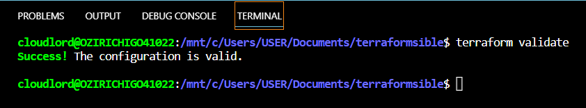
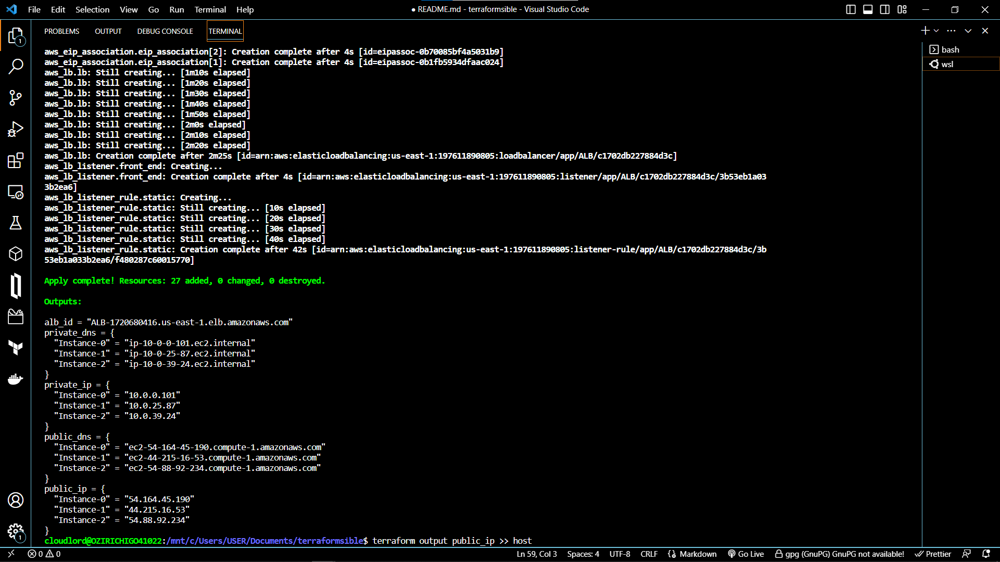
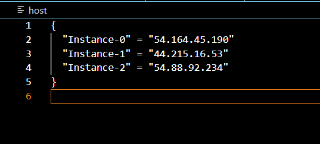
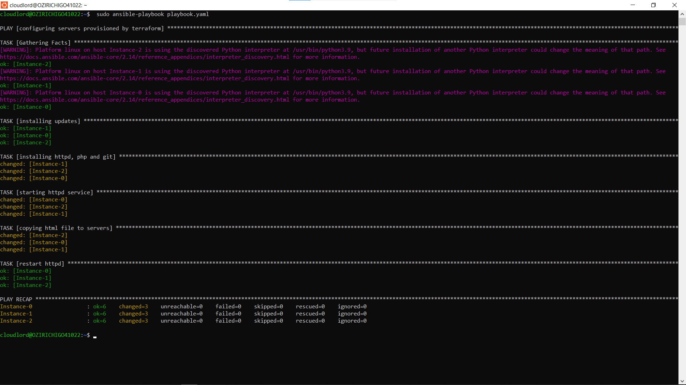
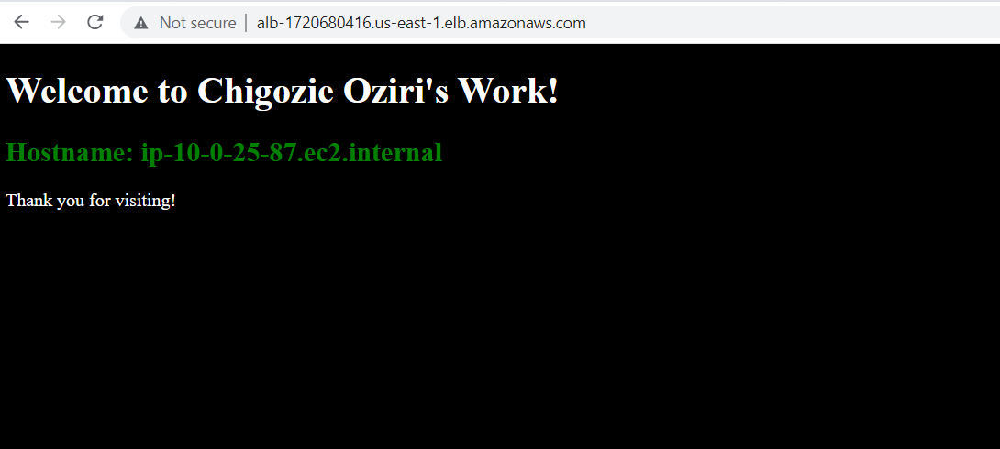

# INTEGRATE TERRAFORM AND ANSIBLE IN PROVISIONING AND CONFIGURING 3-EC2 INSTANCES BEHIND AN ELASTIC APPLICATION LOAD BALANCER ON AWS
## Resources to provision
1. A Virtual Private Cloud (VPC)
2. Three Public Subnets
3. Three Internet Gateways
4. Public Route Tables
5. Security Group
6. Three EC2 Instances
7. ALB
8. Target Group

### Step 1
- Define Provider Details in the [provider.tf](./provider.tf) file

### Step 2 
- Define all Required Variables in the [variable.tf](./variable.tf) file

### Step 3 
- Create Networking Components (VPC, Subnets, Igw, Route Tables) in the [vpc_subnet.tf](./vpc_subnet.tf) file

### Step 4 
- Create a Custom Security Group in [security.tf](./security.tf) file to enable SSH, HTTP & HTTPS access
  
### Step 5 
- Create 3 EC2 Instances using the count method in the [ec2.tf](./ec2.tf) file

### Step 6 
- Fetch Availability Zone and Instance Role Details Using Data Block. View the [data.tf](./data.tf) file

### Step 7
- In the [alb.tf](./alb.tf) file, we create the Target Group and Application Load Balancer (A.L.B). The target group, as the name implies, sets our deployed servers as the target of our A.L.B.

### Step 8
- Create a [userdata](userdata.sh) Shell Script for updating servers on spin up

### Step 9 
- Provide a Few Required Outputs in the [Output.tf](output.tf) file
------------------------------------------------------------------
> After creating all required tf files, we initiate terraform to download every necessary module and providers. Before doing that we can format all tf files to make them more readable using `terraform fmt`. 
>
> `terraform validate`: This command is used to validate the codes which are written. If there is any syntax mismatching, then it will throw an error to get this fixed, else, you'd get this success prompt 
>
> `terraform init`: This command initializes the providers and/or modules mentioned in your script(s). Which means by running this cmd, terraform simply downloads all APIs relevant to your specific cloud provider and modules to ensure successful execution of further operations.

> `terraform plan`: after `terraform init` runs successfully, `terraform plan` displays the details of how terraform will proceed with executing all the commands stated in our script(s) to provision our desired resources in the right order.
>
> `terraform apply`: with this command, we finally execute our infrastructure to provision all the resources we have stated in an actual cloud environment (which in this case is AWS).  
> 
> Before now, you must have configured your aws command line interface. If not, run `aws configure` and at the prompt enter your aws access_key_id, secret_access_key, default region and format (json or yaml).
>
> `terraform output public_ip >> host` : running this command in the terminal copies the public IP addresses of the EC2 instances we have created on AWS to a local file which we have named hosts. This file will serve as our host inventory file when we use Ansible to configure the servers (or EC2 instances) which we have created with terraform. You'll need to modify the resulting `hosts` file which comes in json format  to meet the standard of an ansible host inventory file. Here we have modified and renamed it [hosts](./hosts). It is worth mentioning that this command works because our [output.tf](./output.tf) file contains the code-block below:
> 
> ```
> output "public_ip" {
>   value = zipmap(aws_instance.instance.*.tags.Name, aws_eip.eip.*.public_ip)
> }
> ``` 
>
-----------------------------------------------------------------------------
## ANSIBLE TIME!
> - Write a simple [index.php file](./index.php) to dynamically display the hostname of our EC2 instances on the browser. This would help us demonstrate how our Elastic ALB balances the load on our different servers. You may choose to use an index.html if you prefer.
> - Write the ansible [playbook](./playbook.yaml)
> Copy the configuration in the [ansible.cfg](./ansible.cfg) file to your default `ansible.cfg` file which is located at the `/etc/ansible` directory.
> 
> `ansible-playbook playbook.yaml -i hosts --key-file newkey.pem`
> - the `-i` flag points our ansible command to the location of our host inventory file.
> - the `--key-file` flag indicates the location of the unique pem key file with which our EC2 instances were spinned up. 
> To grant ansible the permission to connect to your instances, before running the `ansible-playbook` command, ensure you give your pem key file the right file permissions: run `sudo chmod 0444 path/to/keyfile.pem`. 
> The `0444` modification allows read only access for both user, group and others- hence your key file is protected, and can also be read by the hosts when we connect with ansible. 
> You can view the ansible playbook [here](./playbook.yaml). 
> After a successful ansible execution, you should have something similar to this .
> 
> Finally, paste the `alb_id` (the DNS of our Load Balancer from the terraform output on the terminal) on your browser, and refresh multiple times to view the ALB balancing the load across the three different ec2-instances. See snapshot .
-------------------------------------------------------------------------------
## ACKNOWLEDGEMENT: 
> - [AltSchool Africa](https://www.altschoolafrica.com)
> - [How to Deploy a Set of EC2 Instances behind an ALB Using Terraform by Plain English](https://plainenglish.io/blog/deploy-a-set-of-ec2-instances-behind-an-alb-using-terraform-403fe584f09e)
> - [Isha Jain's article on Medium](https://medium.com/geekculture/the-most-simplified-integration-of-ansible-and-terraform-49f130b9fc8)
> 